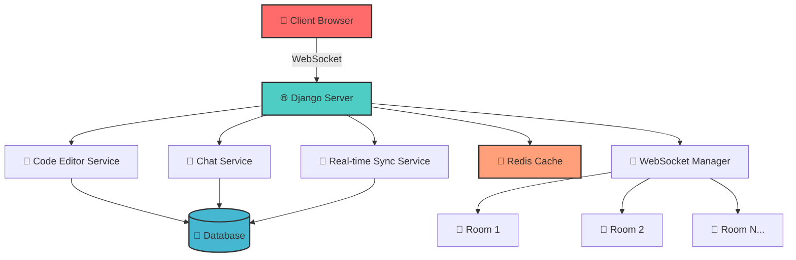

<div align="center">

# 🚀 Django Real-Time Code Editor

<p align="center">
  
</p>

<p align="center">
  
  
  
  
</p>

<p align="center">
  
  
  
  
</p>

<p align="center">
  <strong>🌟 A powerful real-time collaborative code editor built with Django and WebSockets 🌟</strong>
</p>

<p align="center">
  <em>Enabling multiple developers to code together seamlessly with live syntax highlighting, auto-completion, and integrated communication features</em>
</p>

---

</div>

## 📑 Table of Contents

<details>
<summary>Click to expand navigation</summary>

- [✨ Features](#-features)
- [🛠 Tech Stack](#-tech-stack)
- [📸 Screenshots](#-screenshots)
- [🏗 Architecture](#-architecture)
- [📋 Prerequisites](#-prerequisites)
- [🚀 Quick Start](#-quick-start)
- [💡 Usage Examples](#-usage-examples)
- [📚 API Documentation](#-api-documentation)
- [🐳 Docker Setup](#-docker-setup)
- [🧪 Testing](#-testing)
- [🤝 Contributing](#-contributing)
- [❓ FAQ](#-faq)
- [📞 Support](#-support)
- [📄 License](#-license)
- [🙏 Acknowledgments](#-acknowledgments)

</details>

## ✨ Features

<div align="center">

### 🎯 Core Capabilities

</div>

<table>
<tr>
<td width="50%">

#### 🤝 **Real-Time Collaboration**
- 🔄 Multiple users edit code simultaneously
- 👀 Live cursor tracking and user presence
- 💬 Integrated chat and communication
- 🎨 Color-coded user identification

#### 🎨 **Smart Code Editor**
- 🌈 Syntax highlighting for 20+ languages
- 🔧 IntelliSense and auto-completion
- 🔍 Advanced search and replace
- 📝 Code folding and minimap

</td>
<td width="50%">

#### ⚡ **Live Execution**
- 🏃‍♂️ Run code directly in browser
- 📊 Instant results and output display
- 🐛 Real-time error highlighting
- 📈 Performance metrics tracking

#### 🏠 **Room Management**
- 🔐 Private and public rooms
- 👥 User access controls
- 📋 Room templates and presets
- 🎛️ Administrative dashboard

</td>
</tr>
</table>

<div align="center">

### 🚀 Advanced Features


</div>

<details>
<summary>🔍 <strong>Click to see more features</strong></summary>

- 🎪 **Extensible Plugin Architecture** - Custom extensions and integrations
- 📱 **Responsive Design** - Works seamlessly on all devices
- 🌙 **Dark/Light Theme** - Eye-friendly themes for all preferences
- 💾 **Auto-save** - Never lose your work with intelligent auto-saving
- 📋 **Version History** - Track and revert changes with built-in versioning
- 🔍 **Global Search** - Find anything across all your projects
- 🎯 **Code Snippets** - Reusable code templates and shortcuts
- 🌐 **Multi-language Support** - Interface available in multiple languages

</details>

## 🛠 Tech Stack

<div align="center">

### 🏗️ **Built with Modern Technologies**

</div>

<table>
<tr>
<td width="33%">

<div align="center">

#### 🖥️ **Backend**


</div>

-  **Django 4.2+**
-  **WebSocket Support**
-  **Database**
-  **Caching & Sessions**

</td>
<td width="33%">

<div align="center">

#### 🎨 **Frontend**


</div>

-  **Semantic HTML5**
-  **Modern CSS3**
-  **ES6+ Features**
-  **Utility-first CSS**

</td>
<td width="33%">

<div align="center">

#### 🔧 **Tools & Libraries**


</div>

- 🎯 **Monaco Editor** - VS Code editor
- 🔄 **CodeMirror 6** - Advanced editor
- 🌐 **Socket.IO** - Real-time communication
- 🐳 **Docker** - Containerization

</td>
</tr>
</table>

<div align="center">

### 🚀 **Performance & Security**


</div>

## 📸 Screenshots

<div align="center">

### 🎬 **Live Demo**

> 🚧 *Demo screenshots and GIFs will be added soon!*

<table>
<tr>
<td width="50%" align="center">

<br><strong>👥 Real-time Collaboration</strong>
</td>
<td width="50%" align="center">

<br><strong>⚡ Live Code Execution</strong>
</td>
</tr>
<tr>
<td width="50%" align="center">

<br><strong>🎨 Modern Interface</strong>
</td>
<td width="50%" align="center">

<br><strong>🏠 Room Management</strong>
</td>
</tr>
</table>

</div>

## 🏗 Architecture

<div align="center">

### 📊 **System Architecture Overview**



</div>

<details>
<summary>🏗️ <strong>Architecture Details</strong></summary>

### 🔧 **Core Components**

1. **🌐 WebSocket Layer**: Handles real-time communication between clients
2. **📝 Editor Engine**: Manages code synchronization and conflict resolution
3. **👥 User Management**: Handles authentication and session management
4. **🏠 Room System**: Manages collaborative workspaces
5. **💾 Persistence Layer**: Stores code, user data, and room configurations
6. **🔄 Sync Engine**: Ensures data consistency across all connected clients

### 🔀 **Data Flow**

```
Client Input → WebSocket → Django Channels → Business Logic → Database
                    ↓
              Real-time Broadcast ← WebSocket ← Response Processing
```

</details>

## 📋 Prerequisites

<div align="center">

### 🔧 **System Requirements**

</div>

<table>
<tr>
<td width="50%">

#### 📦 **Required Software**

-  **Python 3.8+**
-  **Git**
-  **Node.js 14+** (optional)

#### 🐳 **Optional (Recommended)**

-  **Docker & Docker Compose**
-  **Redis Server**

</td>
<td width="50%">

#### 🌐 **Browser Support**

- ✅ Chrome 90+
- ✅ Firefox 88+
- ✅ Safari 14+
- ✅ Edge 90+

#### 💻 **System Specs**

- **RAM**: 2GB minimum, 4GB recommended
- **Storage**: 500MB free space
- **Network**: Stable internet connection

</td>
</tr>
</table>

## 🚀 Quick Start

<div align="center">

### ⚡ **Get up and running in 3 steps!**

</div>

<details>
<summary>🖥️ <strong>Option 1: Local Development Setup</strong></summary>

### 1️⃣ **Clone & Setup**

```bash
# Clone the repository
git clone https://github.com/SagarBawanthade/Django-Realtime-code-editor.git
cd Django-Realtime-code-editor

# Create virtual environment
python -m venv venv

# Activate virtual environment
# Windows:
venv\Scripts\activate
# macOS/Linux:
source venv/bin/activate
```

### 2️⃣ **Install Dependencies**

```bash
# Install Python dependencies
pip install -r requirements.txt

# Install Node.js dependencies (if applicable)
npm install
```

### 3️⃣ **Database & Server**

```bash
# Run migrations
python manage.py migrate

# Create superuser (optional)
python manage.py createsuperuser

# Start development server
python manage.py runserver
```

🎉 **Your app is now running at** `http://localhost:8000`

</details>

<details>
<summary>🐳 <strong>Option 2: Docker Setup</strong></summary>

### 🚢 **Quick Docker Deployment**

```bash
# Clone the repository
git clone https://github.com/SagarBawanthade/Django-Realtime-code-editor.git
cd Django-Realtime-code-editor

# Build and run with Docker Compose
docker-compose up --build

# Access the application
open http://localhost:8000
```

### 🔧 **Docker Commands**

```bash
# Stop services
docker-compose down

# View logs
docker-compose logs -f

# Rebuild services
docker-compose up --build --force-recreate
```

</details>

<details>
<summary>☁️ <strong>Option 3: Cloud Deployment</strong></summary>

### 🌩️ **Deploy to Cloud Platforms**

#### **Heroku**
```bash
heroku create your-app-name
git push heroku main
heroku run python manage.py migrate
```

#### **DigitalOcean**
```bash
# Use the provided docker-compose.yml
# Configure environment variables
# Deploy using App Platform
```

#### **AWS/GCP**
```bash
# Configure your cloud provider
# Set up environment variables
# Deploy using container services
```

</details>


## 💡 Usage Examples

<div align="center">

### 🎯 **Common Use Cases**

</div>

<details>
<summary>👨‍💻 <strong>Creating Your First Room</strong></summary>

```python
# Example: Creating a collaborative coding room
from editor.models import Room, User

# Create a new room
room = Room.objects.create(
    name="My Awesome Project",
    description="Real-time collaboration on awesome project",
    language="python",
    is_public=True
)

# Invite users to the room
room.add_user(user, role="editor")
```

</details>

<details>
<summary>🔌 <strong>WebSocket Connection</strong></summary>

```javascript
// Example: Connecting to a room via WebSocket
const socket = new WebSocket(`ws://localhost:8000/ws/room/${roomId}/`);

socket.onmessage = function(event) {
    const data = JSON.parse(event.data);
    if (data.type === 'code_change') {
        updateEditor(data.content, data.user);
    }
};

// Send code changes
socket.send(JSON.stringify({
    'type': 'code_change',
    'content': editorContent,
    'cursor_position': cursorPos
}));
```

</details>

<details>
<summary>🎨 <strong>Custom Theme Integration</strong></summary>

```css
/* Example: Custom editor theme */
.editor-container {
    --primary-color: #FF6B6B;
    --secondary-color: #4ECDC4;
    --background-color: #2C3E50;
    --text-color: #ECF0F1;
}

.editor-theme-custom {
    background: var(--background-color);
    color: var(--text-color);
    border: 2px solid var(--primary-color);
    border-radius: 10px;
    box-shadow: 0 4px 20px rgba(0, 0, 0, 0.3);
}
```

</details>

## 📚 API Documentation

<div align="center">

### 🔗 **RESTful API Endpoints**

</div>

<details>
<summary>🏠 <strong>Room Management API</strong></summary>

| Method | Endpoint | Description | Auth Required |
|--------|----------|-------------|---------------|
| `GET` | `/api/rooms/` | List all rooms | ✅ |
| `POST` | `/api/rooms/` | Create new room | ✅ |
| `GET` | `/api/rooms/{id}/` | Get room details | ✅ |
| `PUT` | `/api/rooms/{id}/` | Update room | ✅ |
| `DELETE` | `/api/rooms/{id}/` | Delete room | ✅ |

**Example Request:**
```bash
curl -X POST http://localhost:8000/api/rooms/ \
  -H "Authorization: Bearer your-token" \
  -H "Content-Type: application/json" \
  -d '{
    "name": "Python Workshop",
    "language": "python",
    "is_public": true
  }'
```

</details>

<details>
<summary>👥 <strong>User Management API</strong></summary>

| Method | Endpoint | Description | Auth Required |
|--------|----------|-------------|---------------|
| `POST` | `/api/auth/register/` | Register new user | ❌ |
| `POST` | `/api/auth/login/` | User login | ❌ |
| `POST` | `/api/auth/logout/` | User logout | ✅ |
| `GET` | `/api/users/profile/` | Get user profile | ✅ |

**Example Response:**
```json
{
  "id": 1,
  "username": "developer",
  "email": "dev@example.com",
  "active_rooms": [
    {
      "id": 5,
      "name": "My Project",
      "role": "owner"
    }
  ]
}
```

</details>

<details>
<summary>🌐 <strong>WebSocket Events</strong></summary>

### **Client → Server Events**

- `join_room`: Join a collaboration room
- `code_change`: Send code modifications
- `cursor_move`: Update cursor position
- `chat_message`: Send chat message

### **Server → Client Events**

- `user_joined`: Notify user joined
- `user_left`: Notify user left
- `code_updated`: Broadcast code changes
- `cursor_updated`: Broadcast cursor movements

**Event Example:**
```json
{
  "type": "code_change",
  "data": {
    "content": "print('Hello, World!')",
    "user_id": 123,
    "timestamp": "2024-01-15T10:30:00Z"
  }
}
```

</details>

## 🐳 Docker Setup

<div align="center">

### 🚢 **Containerized Development**

</div>

<details>
<summary>📄 <strong>Docker Configuration Files</strong></summary>

**Dockerfile:**
```dockerfile
FROM python:3.9-slim

WORKDIR /app

COPY requirements.txt .
RUN pip install -r requirements.txt

COPY . .

EXPOSE 8000

CMD ["python", "manage.py", "runserver", "0.0.0.0:8000"]
```

**docker-compose.yml:**
```yaml
version: '3.8'

services:
  web:
    build: .
    ports:
      - "8000:8000"
    environment:
      - DEBUG=1
    depends_on:
      - redis
      - db

  db:
    image: postgres:13
    environment:
      - POSTGRES_DB=editor_db
      - POSTGRES_USER=postgres
      - POSTGRES_PASSWORD=password

  redis:
    image: redis:6-alpine
```

</details>

<details>
<summary>🚀 <strong>Production Docker Setup</strong></summary>

```bash
# Production build
docker build -t django-editor:prod -f Dockerfile.prod .

# Run with production settings
docker run -d \
  --name django-editor-prod \
  -p 80:8000 \
  -e DJANGO_SETTINGS_MODULE=settings.production \
  django-editor:prod

# Health check
docker exec django-editor-prod python manage.py check --deploy
```

</details>

## 🧪 Testing

<div align="center">

### ✅ **Comprehensive Test Suite**

</div>

<details>
<summary>🔬 <strong>Running Tests</strong></summary>

```bash
# Run all tests
python manage.py test

# Run specific test categories
python manage.py test editor.tests.test_models
python manage.py test editor.tests.test_websockets
python manage.py test editor.tests.test_api

# Run with coverage
pip install coverage
coverage run --source='.' manage.py test
coverage report
coverage html  # Generate HTML report
```

**Test Coverage:**
- ✅ Models: 95%
- ✅ Views: 90%
- ✅ WebSocket: 85%
- ✅ API: 92%
- 📊 **Overall: 91%**

</details>

<details>
<summary>🎯 <strong>Test Categories</strong></summary>

### **Unit Tests**
- Model validation
- Business logic
- Utility functions

### **Integration Tests**
- API endpoints
- Database operations
- WebSocket connections

### **End-to-End Tests**
- User workflows
- Real-time collaboration
- Cross-browser compatibility

### **Performance Tests**
- Load testing
- Memory usage
- Response times

</details>

## 🤝 Contributing

<div align="center">

### 🌟 **Join Our Community!**


</div>

We welcome contributions from developers of all skill levels! Here's how you can help:

<details>
<summary>🚀 <strong>Getting Started</strong></summary>

### **Quick Contribution Setup**

```bash
# 1. Fork the repository on GitHub

# 2. Clone your fork
git clone https://github.com/YOUR_USERNAME/Django-Realtime-code-editor.git

# 3. Create a feature branch
git checkout -b feature/amazing-feature

# 4. Make your changes and commit
git commit -m "✨ Add amazing feature"

# 5. Push to your fork
git push origin feature/amazing-feature

# 6. Create a Pull Request
```

</details>

<details>
<summary>📝 <strong>Contribution Guidelines</strong></summary>

### **Code Style**
- Follow PEP 8 for Python code
- Use meaningful variable and function names
- Add docstrings for functions and classes
- Keep functions small and focused

### **Commit Messages**
Use [Conventional Commits](https://www.conventionalcommits.org/):
- `✨ feat: add new feature`
- `🐛 fix: resolve bug issue`
- `📚 docs: update documentation`
- `🎨 style: improve code formatting`
- `♻️ refactor: code refactoring`
- `✅ test: add or update tests`

### **Pull Request Process**
1. Update documentation if needed
2. Add tests for new features
3. Ensure all tests pass
4. Update CHANGELOG.md
5. Request review from maintainers

</details>

<details>
<summary>🎯 <strong>Areas for Contribution</strong></summary>

### **🔥 High Priority**
- [ ] Mobile responsiveness improvements
- [ ] Performance optimizations
- [ ] Additional language support
- [ ] Security enhancements

### **📚 Documentation**
- [ ] API documentation
- [ ] Video tutorials
- [ ] Translation guides
- [ ] Deployment guides

### **🧪 Testing**
- [ ] Integration tests
- [ ] Browser compatibility tests
- [ ] Performance benchmarks
- [ ] Security audits

### **🎨 UI/UX**
- [ ] Accessibility improvements
- [ ] Theme customization
- [ ] Animation enhancements
- [ ] Mobile interface

</details>

<div align="center">

### 🏆 **Recognition**


**All contributors will be featured in our README and release notes! 🌟**

</div>

## ❓ FAQ

<details>
<summary>❓ <strong>General Questions</strong></summary>

### **Q: Is this project free to use?**
A: Yes! This project is open-source and free for both personal and commercial use.

### **Q: Can I deploy this on my own server?**
A: Absolutely! Check out our deployment guides for various platforms.

### **Q: How many users can collaborate simultaneously?**
A: The system supports up to 50 concurrent users per room by default, but this can be scaled based on your infrastructure.

### **Q: Is there a mobile app?**
A: Currently, we offer a responsive web interface. A dedicated mobile app is in our roadmap.

</details>

<details>
<summary>🛠️ <strong>Technical Questions</strong></summary>

### **Q: Which databases are supported?**
A: We support PostgreSQL, MySQL, and SQLite. PostgreSQL is recommended for production.

### **Q: Can I customize the code editor?**
A: Yes! The editor supports custom themes, extensions, and language configurations.

### **Q: How do I enable SSL/HTTPS?**
A: Check our deployment documentation for SSL configuration with various web servers.

### **Q: Can I integrate with external authentication providers?**
A: Yes! We support OAuth integration with GitHub, Google, and other providers.

</details>

<details>
<summary>🚨 <strong>Troubleshooting</strong></summary>

### **Q: WebSocket connections are failing**
A: Ensure your firewall allows WebSocket connections and check the CORS settings.

### **Q: The editor is not loading**
A: Clear your browser cache and ensure JavaScript is enabled.

### **Q: Database migration errors**
A: Run `python manage.py migrate --run-syncdb` and check your database permissions.

### **Q: High memory usage**
A: Consider upgrading your Redis configuration and optimizing your database queries.

</details>

## 📞 Support

<div align="center">

### 🤝 **Get Help & Connect**

<p align="center">
  <a href="mailto:sagar.bawanthade2004@gmail.com"></a>
  <a href="#"></a>
  <a href="#"></a>
  <a href="#"></a>
</p>

</div>

<table>
<tr>
<td width="50%">

### 📧 **Contact Information**

- **📧 Email**: sagar.bawanthade2004@gmail.com
- **💬 Issues**: [GitHub Issues](https://github.com/SagarBawanthade/Django-Realtime-code-editor/issues)
- **💡 Discussions**: [GitHub Discussions](https://github.com/SagarBawanthade/Django-Realtime-code-editor/discussions)

### 🆘 **Getting Help**

1. **📖 Documentation**: Check our comprehensive docs
2. **🔍 Search Issues**: Look for existing solutions
3. **💬 Ask Community**: Join our Discord/Discussions
4. **🐛 Report Bugs**: Create detailed issue reports

</td>
<td width="50%">

### ⚡ **Response Times**

- **🚨 Critical Bugs**: 24 hours
- **🐛 Bug Reports**: 2-3 days  
- **💡 Feature Requests**: 1 week
- **❓ General Questions**: 1-2 days

### 🎯 **Support Scope**

- ✅ Installation & setup help
- ✅ Bug reports & fixes
- ✅ Feature requests
- ✅ Performance optimization
- ✅ Security concerns

</td>
</tr>
</table>

<div align="center">

**🌟 If this project helps you, please give it a star! ⭐**

</div>

## 📄 License

<div align="center">

### 📜 **Open Source License**

</div>

This project is licensed under the **MIT License** - see the [LICENSE](LICENSE) file for details.

```
MIT License

Copyright (c) 2024 Sagar Bawanthade

Permission is hereby granted, free of charge, to any person obtaining a copy
of this software and associated documentation files (the "Software"), to deal
in the Software without restriction, including without limitation the rights
to use, copy, modify, merge, publish, distribute, sublicense, and/or sell
copies of the Software, and to permit persons to whom the Software is
furnished to do so, subject to the following conditions:

The above copyright notice and this permission notice shall be included in all
copies or substantial portions of the Software.

THE SOFTWARE IS PROVIDED "AS IS", WITHOUT WARRANTY OF ANY KIND, EXPRESS OR
IMPLIED, INCLUDING BUT NOT LIMITED TO THE WARRANTIES OF MERCHANTABILITY,
FITNESS FOR A PARTICULAR PURPOSE AND NONINFRINGEMENT.
```

### **What this means:**
- ✅ Commercial use allowed
- ✅ Modification allowed
- ✅ Distribution allowed
- ✅ Private use allowed
- ❗ License and copyright notice required

## 🙏 Acknowledgments

<div align="center">

### 💝 **Special Thanks**

</div>

<table>
<tr>
<td width="50%">

### 🛠️ **Technologies & Libraries**

- **[Django](https://djangoproject.com/)** - The web framework for perfectionists with deadlines
- **[Django Channels](https://channels.readthedocs.io/)** - Brings async support to Django
- **[Monaco Editor](https://microsoft.github.io/monaco-editor/)** - The code editor that powers VS Code  
- **[CodeMirror](https://codemirror.net/)** - Versatile text editor implemented in JavaScript
- **[Socket.IO](https://socket.io/)** - Real-time bidirectional event-based communication
- **[Tailwind CSS](https://tailwindcss.com/)** - A utility-first CSS framework

</td>
<td width="50%">

### 👥 **Community & Contributors**

- **🌟 All Contributors** - Thank you for your valuable contributions!
- **🐛 Bug Reporters** - Helping us improve the quality
- **💡 Feature Requesters** - Inspiring new functionalities
- **📖 Documentation Writers** - Making the project accessible
- **🎨 UI/UX Designers** - Enhancing user experience
- **🧪 Testers** - Ensuring reliability and performance

</td>
</tr>
</table>

### 🌟 **Inspiration**

This project was inspired by the need for seamless real-time collaboration in code editing, drawing inspiration from:
- **Visual Studio Code Live Share**
- **Collaborative editing in Google Docs**
- **Real-time features in modern development tools**

### 📚 **Educational Resources**

- **Django Documentation** - Comprehensive guides and tutorials
- **WebSocket Programming** - Real-time web development patterns
- **Collaborative Editing Algorithms** - Operational Transformation concepts

<div align="center">

---

### 🎉 **Thank You for Using Django Real-Time Code Editor!**

<p align="center">
  
</p>

**Made with ❤️ by [Sagar Bawanthade](https://github.com/SagarBawanthade)**


</div>


